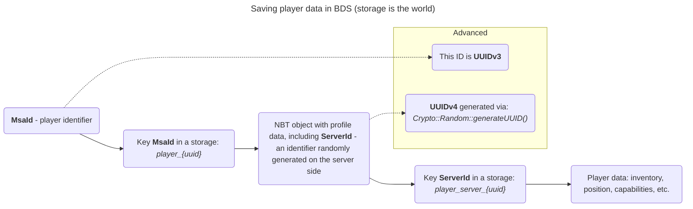

 

# PlayerDB
A mod containing powerful tools for collecting and analyzing data from players.
## What does this mod do?
This mod allows owners of [BDS](https://www.minecraft.net/en-us/download/server/bedrock) servers managed by [LeviLamina](https://github.com/LiteLDev/LeviLamina) to store player data, mainly obtained from [LoginPacket](https://github.com/LiteLDev/LeviLamina/blob/v1.6.0/src-server/mc/network/packet/LoginPacketPayload.h). The mod is largely intended for developers who face the following problems:
- by what parameter to save the record (data) of a player without an account [Xbox Live](https://minecraft.wiki/w/Microsoft_authentication);
- how to solve the problem with resetting progress for a player without an account [Xbox Live](https://minecraft.wiki/w/Microsoft_authentication);
- how to [give a rank](https://github.com/LordBombardir/LLPowerRanks) to a player who has never logged into the server;
- how to quickly find similar accounts;
- and other similar tasks.
## Principle of data storage
<table>
  <tr>
    <th colspan="4">Hooks are the foundation of data persistence</th>
  </tr>
  <tr>
    <th align="center">Number</th>
    <th align="center">Event</th>
    <th align="center">Identifier</th>
    <th align="center">Priority</th>
  </tr>
  <tr>
    <th align="center">1</th>
    <td align="center">Connecting a player to the server</td>
    <td align="center"><code>ServerNetworkHandler::sendLoginMessageLocal</code></td>
    <td align="center"><code>HookPriority::High</code></td>
  </tr>
  <tr>
    <th align="center">2</th>
    <td align="center">Player exit</td>
    <td align="center"><code>ServerPlayer::disconnect</code></td>
    <td align="center"><code>HookPriority::Normal</code></td>
  </tr>
  <tr>
    <th align="center">3</th>
    <td align="center">Player spawn</td>
    <td align="center"><code>ServerPlayer::doInitialSpawn</code></td>
    <td align="center"><code>HookPriority::Normal</code></td>
  </tr>
  <tr>
    <th align="center">4</th>
    <td align="center">Changing the logic for obtaining the UUID (<code>identity</code>) of a player</td>
    <td align="center"><code>LegacyMultiplayerToken::getIdentity</code></td>
    <td align="center"><code>HookPriority::Normal</code></td>
  </tr>
</table>

For hook #1, this priority was not chosen by chance: first, players with fake data must be screened out using third-party tools, then the data that has passed the check is recorded in the database, after which the punishment system determines whether a player with a punishment enters the server.

Hook #4 is used to prevent players who do not have an Xbox Live account from resetting their progress: it often happens that `MsaId` is reset when reinstalling or updating the game. More details in the diagram.

When a player connects to the server, all useful data is collected from him, which he transmits to the server, including login time (in Unix format). But if the player has not yet been registered in the database, then a “temporary record” is created. These records were made to protect the database from being overfilled with unnecessary data. If a player does not spawn, but immediately leaves, then this entry is deleted.
## Database and data stored in it
The database is an SQLite3 file controlled by the library [sqlite_orm](https://github.com/fnc12/sqlite_orm), which simplifies access to data for system administrators and also allows solving the problem of quickly filtering players.

<table>
  <tr>
    <th colspan="4">Class <code>PlayerEntry</code></th>
  </tr>
  <tr>
    <th align="center">Number</th>
    <th align="center">Field type and name</th>
    <th align="center">Explained name</th>
  </tr>
  <tr>
    <th align="center">1</th>
    <td align="center"><code>mce::UUID uuid</code></td>
    <td align="center">Unique record identifier</td>
  </tr>
  <tr>
    <th align="center">2</th>
    <td align="center"><code>std::string name</code></td>
    <td align="center">Player nickname</td>
  </tr>
  <tr>
    <th align="center">3</th>
    <td align="center"><code>std::optional&lt;std::string&gt; xuid</code></td>
    <td align="center">Xbox Live Account ID</td
  </tr>
  <tr>
    <th align="center">4</th>
    <td align="center"><code>mce::UUID minecraftUUID</code></td>
    <td align="center">Game account ID</td>
  </tr>
  <tr>
    <th align="center">5</th>
    <td align="center"><code>std::string latestIpAddress</code></td>
    <td align="center">Latest IPv4 address</td>
  </tr>
  <tr>
    <th align="center">6</th>
    <td align="center"><code>time_t latestJoinTime</code></td>
    <td align="center">Recent time (in Unix format) connecting to the server</td>
  </tr>
  <tr>
    <th align="center">7</th>
    <td align="center"><code>time_t latestQuitTime</code></td>
    <td align="center">Latest time (in Unix format) the logout from the server</td>
  </tr>
  <tr>
    <th align="center">8</th>
    <td align="center"><code>std::string latestLocaleCode</code></td>
    <td align="center">Latest language code of the client</td>
  </tr>
  <tr>
    <th align="center">9</th>
    <td align="center"><code>unsigned long long latestCID</code></td>
    <td align="center">Latest CID of the client</td>
  </tr>
  <tr>
    <th align="center">10</th>
    <td align="center"><code>std::string latestSkinId</code></td>
    <td align="center">Latest identifier of the client's skin</td>
  </tr>
  <tr>
    <th align="center">11</th>
    <td align="center"><code>std::string latestGameVersion</code></td>
    <td align="center">Latest version of the client</td>
  </tr>
  <tr>
    <th align="center">12</th>
    <td align="center"><code>std::string latestDeviceId</code></td>
    <td align="center">Latest identifier of the client's device</td>
  </tr>
  <tr>
    <th align="center">13</th>
    <td align="center"><code>DeviceOS latestDeviceOS</code></td>
    <td align="center">Latest type (Android, iOS) of the client's device</td>
  </tr>
  <tr>
    <th align="center">14</th>
    <td align="center"><code>std::string latestSkinId</code></td>
    <td align="center">Latest is the client's skin ID</td>
  </tr>
  <tr>
    <th align="center">15</th>
    <td align="center"><code>std::string latestDeviceModel</code></td>
    <td align="center">Latest model of the client's device</td>
  </tr>
  <tr>
    <th align="center">16</th>
    <td align="center"><code>std::string latestSelfSignedId</code></td>
    <td align="center">Latest SelfSignedId of the client</td>
  </tr>
  <tr>
    <th align="center">17</th>
    <td align="center"><code>std::string latestPlayFabId</code></td>
    <td align="center">Latest PlayFabId of the client</td>
  </tr>
</table>

<table>
  <tr>
    <th colspan="4">Descriptions of class fields <code>PlayerEntry</code></th>
  </tr>
  <tr>
    <th align="center">Number</th>
    <th align="center">Description</th>
  </tr>
  <tr>
    <th align="center">1</th>
    <td align="center">This is the UUID (it can be any version) that PlayerDB randomly generated. The value should be used by other mods that are going to store player data</td>
  </tr>
  <tr>
    <th align="center">2</th>
    <td align="center">The value <a href="https://support.xbox.com/ru-RU/help/account-profile/profile/change-xbox-live-gamertag">may change</a>, but PlayerDB will synchronize the value anyway. Note: changing a nickname is NOT creating a new account with a new <code>XUID</code>!</td>
  </tr>
  <tr>
    <th align="center">3</th>
    <td align="center">—</td>
  </tr>
  <tr>
    <th align="center">4</th>
    <td align="center">The seemingly immutable part. But it can change for unverified players. The parameter may be named differently: <code>MsaId</code>, <code>Identity</code></td>
  </tr>
  <tr>
    <th align="center">5</th>
    <td align="center">—</td>
  </tr>
  <tr>
    <th align="center">6</th>
    <td align="center">—</td>
  </tr>
  <tr>
    <th align="center">7</th>
    <td align="center">A value of 0 indicates that the player is currently on the server</td>
  </tr>
  <tr>
    <th align="center">8</th>
    <td align="center">—</td>
  </tr>
  <tr>
    <th align="center">9</th>
    <td align="center">—</td>
  </tr>
  <tr>
    <th align="center">10</th>
    <td align="center">—</td>
  </tr>
  <tr>
    <th align="center">11</th>
    <td align="center">—</td>
  </tr>
  <tr>
    <th align="center">12</th>
    <td align="center">—</td>
  </tr>
  <tr>
    <th align="center">13</th>
    <td align="center">—</td>
  </tr>
  <tr>
    <th align="center">14</th>
    <td align="center">—</td>
  </tr>
  <tr>
    <th align="center">15</th>
    <td align="center">—</td>
  </tr>
  <tr>
    <th align="center">16</th>
    <td align="center">—</td>
  </tr>
  <tr>
    <th align="center">17</th>
    <td align="center">—</td>
  </tr>
</table>

## Used libraries
| Title      | License                                | Link                                |
| :--------: | :------------------------------------: | :-----------------------------------: |
| sqlite_orm | GNU Affero General Public License v3.0 | https://github.com/fnc12/sqlite_orm   |
| magic_enum | MIT License                            | https://github.com/Neargye/magic_enum |
| cppcodec   | MIT License                            | https://github.com/tplgy/cppcodec     |

## License
Copyright © 2025 LordBombardir. All rights reserved.