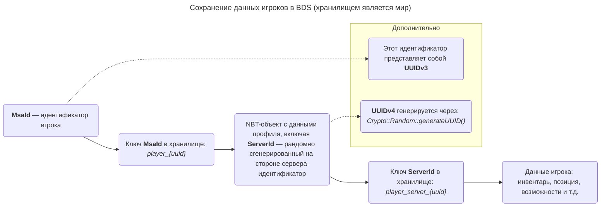

 

# PlayerDB
Мод, содержащий мощные инструменты для сбора и анализа данных, поступающих от игроков.
## Что делает этот мод?
Данный мод позволяет владельцам серверов [BDS](https://www.minecraft.net/ru-ru/download/server/bedrock) под управлением [LeviLamina](https://github.com/LiteLDev/LeviLamina) хранить данные игроков, преимущественно получаемые из [LoginPacket](https://github.com/LiteLDev/LeviLamina/blob/v1.6.0/src-server/mc/network/packet/LoginPacketPayload.h). Мод по большому счёту предназначен для разработчиков, которые сталкиваются с такими проблемами:
- по какому параметру сохранить запись (данные) игрока без учётной записи [Xbox Live](https://minecraft.wiki/w/Microsoft_authentication);
- как решить проблему со сбросом прогресса у игрока без учётной записи [Xbox Live](https://minecraft.wiki/w/Microsoft_authentication);
- как [выдать ранг](https://github.com/LordBombardir/LLPowerRanks) игроку, который ещё ни разу не заходил на сервер;
- как быстро найти твинки;
- и другие похожие задачи.
## Принцип сохранения данных
<table>
  <tr>
    <th colspan="4">Хуки, являющиеся фундаментом сохранения данных</th>
  </tr>
  <tr>
    <th align="center">Номер</th>
    <th align="center">Событие</th>
    <th align="center">Идентификатор</th>
    <th align="center">Приоритет</th>
  </tr>
  <tr>
    <th align="center">1</th>
    <td align="center">Подключение игрока к серверу</td>
    <td align="center"><code>ServerNetworkHandler::sendLoginMessageLocal</code></td>
    <td align="center"><code>HookPriority::High</code></td>
  </tr>
  <tr>
    <th align="center">2</th>
    <td align="center">Выход игрока</td>
    <td align="center"><code>ServerPlayer::disconnect</code></td>
    <td align="center"><code>HookPriority::Normal</code></td>
  </tr>
  <tr>
    <th align="center">3</th>
    <td align="center">Спавн игрока</td>
    <td align="center"><code>ServerPlayer::doInitialSpawn</code></td>
    <td align="center"><code>HookPriority::Normal</code></td>
  </tr>
  <tr>
    <th align="center">4</th>
    <td align="center">Изменение логики получения UUID (<code>identity</code>) игрока</td>
    <td align="center"><code>LegacyMultiplayerToken::getIdentity</code></td>
    <td align="center"><code>HookPriority::Normal</code></td>
  </tr>
</table>

У хука №1 такой приоритет был выбран не случайно: сначала сторонними средствами должны отсеиваться игроки с фейковыми данными, затем прошедшие проверку данные записываются БД, после чего система наказаний определяет, заходит ли на сервер игрок с наказанием.

Хук №4 используется для недопущения сброса прогресса у игроков, не имеющих учётную запись Xbox Live: нередко происходит так, что `MsaId` при переустановке или обновлении игры сбрасывается. Подробнее — в диаграмме.

При подключении игрока к серверу с него собираются все полезные данные, которые он передаёт серверу, включая время входа (в формате Unix). Но если игрок ещё не числился в БД, то создаётся "временная запись". Данные записи сделаны с целью защиты БД от переполнения лишними данными. Если игрок он не спавнится, а сразу выходит, то эта запись удаляется.
## База данных и хранящиеся в ней данные
Базой данных является SQLite3 файл под управлением библиотеки [sqlite_orm](https://github.com/fnc12/sqlite_orm), что упрощает доступ к данным системным администраторам, а также позволяет решить проблему быстрой фильтрации игроков.

<table>
  <tr>
    <th colspan="4">Класс <code>PlayerEntry</code></th>
  </tr>
  <tr>
    <th align="center">Номер</th>
    <th align="center">Тип поля и его название</th>
    <th align="center">Расшифрованное название</th>
  </tr>
  <tr>
    <th align="center">1</th>
    <td align="center"><code>mce::UUID uuid</code></td>
    <td align="center">Уникальный идентификатор записи</td>
  </tr>
  <tr>
    <th align="center">2</th>
    <td align="center"><code>std::string name</code></td>
    <td align="center">Никнейм игрока</td>
  </tr>
  <tr>
    <th align="center">3</th>
    <td align="center"><code>std::optional&lt;std::string&gt; xuid</code></td>
    <td align="center">Идентификатор учётной записи Xbox Live</td
  </tr>
  <tr>
    <th align="center">4</th>
    <td align="center"><code>mce::UUID minecraftUUID</code></td>
    <td align="center">Идентификатор игрового аккаунта</td>
  </tr>
  <tr>
    <th align="center">5</th>
    <td align="center"><code>std::string latestIpAddress</code></td>
    <td align="center">Последний IPv4-адрес</td>
  </tr>
  <tr>
    <th align="center">6</th>
    <td align="center"><code>time_t latestJoinTime</code></td>
    <td align="center">Последнее время (в формате Unix) подключения к серверу</td>
  </tr>
  <tr>
    <th align="center">7</th>
    <td align="center"><code>time_t latestQuitTime</code></td>
    <td align="center">Последнее время (в формате Unix) выхода с сервера</td>
  </tr>
  <tr>
    <th align="center">8</th>
    <td align="center"><code>std::string latestLocaleCode</code></td>
    <td align="center">Последний языковой код клиента</td>
  </tr>
  <tr>
    <th align="center">9</th>
    <td align="center"><code>unsigned long long latestCID</code></td>
    <td align="center">Последний CID клиента</td>
  </tr>
  <tr>
    <th align="center">10</th>
    <td align="center"><code>std::string latestSkinId</code></td>
    <td align="center">Последний идентификатор скина клиента</td>
  </tr>
  <tr>
    <th align="center">11</th>
    <td align="center"><code>std::string latestGameVersion</code></td>
    <td align="center">Последняя версия клиента</td>
  </tr>
  <tr>
    <th align="center">12</th>
    <td align="center"><code>std::string latestDeviceId</code></td>
    <td align="center">Последний идентификатор устройства клиента</td>
  </tr>
  <tr>
    <th align="center">13</th>
    <td align="center"><code>DeviceOS latestDeviceOS</code></td>
    <td align="center">Последний тип (Android, iOS) устройства клиента</td>
  </tr>
  <tr>
    <th align="center">14</th>
    <td align="center"><code>std::string latestSkinId</code></td>
    <td align="center">Последнее идентификатор скина клиента</td>
  </tr>
  <tr>
    <th align="center">15</th>
    <td align="center"><code>std::string latestDeviceModel</code></td>
    <td align="center">Последняя модель устройства клиента</td>
  </tr>
  <tr>
    <th align="center">16</th>
    <td align="center"><code>std::string latestSelfSignedId</code></td>
    <td align="center">Последний SelfSignedId клиента</td>
  </tr>
  <tr>
    <th align="center">17</th>
    <td align="center"><code>std::string latestPlayFabId</code></td>
    <td align="center">Последний PlayFabId клиента</td>
  </tr>
  <tr>
    <th align="center">18</th>
    <td align="center"><code>std::string latestAccountPlayfabId</code></td>
    <td align="center">Последний TitleAccountPlayfabId клиента</td>
  </tr>
  <tr>
    <th align="center">19</th>
    <td align="center"><code>std::optional&lt;std::string&gt; latestTitleId</code></td>
    <td align="center">Последний TitleId клиента</td>
  </tr>
</table>

<table>
  <tr>
    <th colspan="4">Описания к полям класса <code>PlayerEntry</code></th>
  </tr>
  <tr>
    <th align="center">Номер</th>
    <th align="center">Описание</th>
  </tr>
  <tr>
    <th align="center">1</th>
    <td align="center">Это - UUID (версия может быть любой), который PlayerDB рандомно сгенерировал. Значение должно использоваться другими модами, которые собираются хранить данные игроков</td>
  </tr>
  <tr>
    <th align="center">2</th>
    <td align="center">Значение <a href="https://support.xbox.com/ru-RU/help/account-profile/profile/change-xbox-live-gamertag">может измениться</a>, но PlayerDB в любом случае синхронизирует значение. Примечание: смена никнейма — НЕ создание нового аккаунта с новым <code>XUID</code>!</td>
  </tr>
  <tr>
    <th align="center">3</th>
    <td align="center">—</td>
  </tr>
  <tr>
    <th align="center">4</th>
    <td align="center">Казалось бы, неизменяемая часть. Но он может измениться у неверифицированных игроков. Параметр может называться иначе: <code>MsaId</code>, <code>Identity</code></td>
  </tr>
  <tr>
    <th align="center">5</th>
    <td align="center">—</td>
  </tr>
  <tr>
    <th align="center">6</th>
    <td align="center">—</td>
  </tr>
  <tr>
    <th align="center">7</th>
    <td align="center">Значение 0 сигнализирует, что игрок в данный момент находится на сервере</td>
  </tr>
  <tr>
    <th align="center">8</th>
    <td align="center">—</td>
  </tr>
  <tr>
    <th align="center">9</th>
    <td align="center">—</td>
  </tr>
  <tr>
    <th align="center">10</th>
    <td align="center">—</td>
  </tr>
  <tr>
    <th align="center">11</th>
    <td align="center">—</td>
  </tr>
  <tr>
    <th align="center">12</th>
    <td align="center">—</td>
  </tr>
  <tr>
    <th align="center">13</th>
    <td align="center">—</td>
  </tr>
  <tr>
    <th align="center">14</th>
    <td align="center">—</td>
  </tr>
  <tr>
    <th align="center">15</th>
    <td align="center">—</td>
  </tr>
  <tr>
    <th align="center">16</th>
    <td align="center">—</td>
  <tr>
    <th align="center">17</th>
    <td align="center">—</td>
  <tr>
    <th align="center">18</th>
    <td align="center">—</td>
  <tr>
    <th align="center">19</th>
    <td align="center">—</td>
  </tr>
</table>

## Использованные библиотеки
| Название   | Лицензия                               | Ссылка                                |
| :--------: | :------------------------------------: | :-----------------------------------: |
| sqlite_orm | GNU Affero General Public License v3.0 | https://github.com/fnc12/sqlite_orm   |
| magic_enum | MIT License                            | https://github.com/Neargye/magic_enum |
| cppcodec   | MIT License                            | https://github.com/tplgy/cppcodec     |

## Лицензия
Авторское право © 2025 LordBombardir. Все права защищены.
